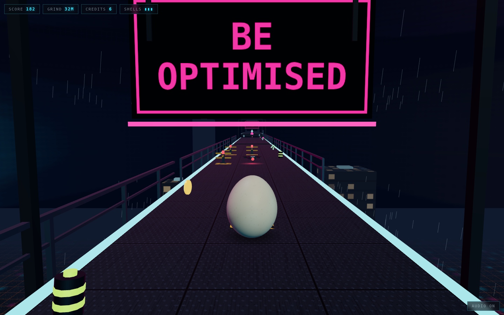
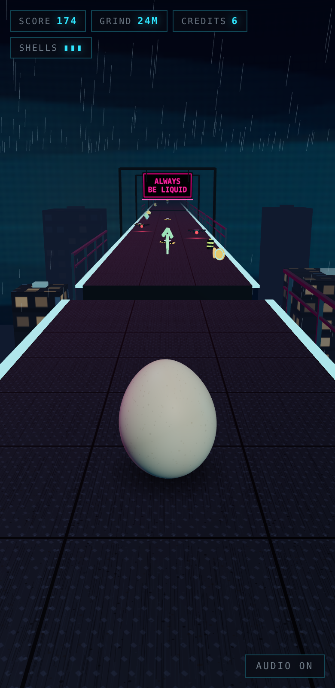

# Eggscape the Permanent Underclass

The egg got out of the Matrix. He got out of the farm. This is the one he
does not get out of, and the score is how long he lasted.

A 3D runner-platformer in the browser: roll east down a service walkway forty
storeys over a city that is watching, hop the breaches, weave the cams, bank
credits that never add up to anything.

The egg is [Marc's](https://github.com/h1ddenpr0cess20/marc), as he is — the
same 128×96 shell through the same `shapeEgg` profile, the same 900-speckle
cream skin, the same physical material with its clearcoat and sheen. Nothing
was added to him for this and nothing was taken away. He is the only thing in
the city that is not owned, rented, metered or watching, and the only warm
colour in it that is not selling something.

He stays upright, too. The silhouette — fat end down, narrow end up — is the
asset, so he rocks and turns on the spot instead of tumbling end over end, and
the squash spring is allowed to flatten him but barely to stretch him.



## Run

```sh
git clone https://github.com/h1ddenpr0cess20/eggscape-iii
cd eggscape-iii
npm install
npm run dev               # → http://localhost:5173
```

No API keys, no server, no account. It is a static page and three.js. Every
surface in the city — plate, grate, tower face, hazard stripe, the streets a
long way down, the sky, every hoarding — is painted onto a canvas at boot, so
there is nothing to download but the code.

## Play

| | |
|---|---|
| `A` `D` / `←` `→` | one lane, per press |
| `W` / `↑` / `space` | hop — again in the air for a flip |
| `S` / `↓` | slam down — onto a cam to take it out |
| `M` | audio |

On a phone: swipe for a lane, flick up to hop, flick down to slam, tap for a
hop.

Three shells. A cam costs one, so does going over the side, and either way the
egg is put back down and keeps going until the last one. A metre is a point, a
credit is twenty-five, and a cam you come down on — in the air, slam on — is
sixty and one fewer cam. Speed climbs with distance, so the city gets harder
because you are getting faster, and the breaches widen to match.

The slam is the only move that answers back. Hop over a cam, put it on, and
the landing goes through the plate and takes the cam in that lane with it —
your lane only, and only a couple of metres of it, so it has to be aimed.

<p align="center">
  
</p>

## What is out there

The city pays in six denominations — chit, shard, cell, keycard, die, tick —
and the course decides which is where when it lays the deck, off its own
seeded stream. That is not decoration: the renderer keeps a pool of meshes per
kind and indexes straight into it, so a keycard is a keycard on every frame
and on every replay of that seed. The shard is the only thing in here the egg
has seen before.

Three things watch the lane. A post cam bolted to the plate, a drone that is
not bolted to anything, and a turnstile, because the city would rather charge
you than chase you. Each of them sweeps its lane until you are close enough to
be worth turning towards, and then it turns — which is the only warning you
get that this one is live.

All three stand on a lit patch of their own: a hazard stripe painted the exact
size of the collider, or, for the drone, the pool of red it throws on the
plate under itself. The rest of a cam is dark equipment on a dark deck at
night in the rain, findable at speed only by running into it, and an obstacle
you cannot see is not difficulty.

Nothing beside the walkway can be touched. Railings, gantry signs and the
towers are all outside the lanes, where the egg cannot reach them, because a
railing you can run through is a lie and the only thing in a lane is a cam.
What they can do is stand on something: every post is driven down the face of
the deck's own truss, since there is no ground out there to bolt it to. The
hoardings span the walkway on gantries rather than standing beside it, for the
same reason — a sign at the edge either floats or crowds the lane you are
trying to read.

## The soundtrack

There is no audio file in the repository, and there is music. `soundtrack.js`
writes it down — one token per sixteenth, `f2! f2? f3+ab3+c4` — and `music.js`
plays it on the same AudioContext the sound effects use, on instruments made
of oscillators and noise. Nothing is built until the page has had a touch,
because no browser will make a sound before one.

The shift is darksynth in F minor: a kick on every beat, a bass pumping
sixteenths under it, rain the whole way through, and over the top a brass
section made of saws, the way the last century imagined this one would sound.
Fm Fm Db Db Bbm Bbm C C — and the C is major, so every eight bars it nearly
resolves, and does not.

It builds with the grind. At a hundred metres come the snare, in a room a great
deal bigger than it is, the hats, and every two bars a camera finding you: one
sine and a long echo. At three hundred the brass and the arpeggio come in, and
at six hundred the lead. A cam that gets you muffles all of it for a second.

Between shifts it is hold music. C major, an electric piano and a vibraphone —
two sines each, one bending the other — on a tape that has been played to a
great many people who were told their call was important, and that warbles
like it. It is the only thing in the city in a major key, it is what you hear
while nothing is happening, and its last bar does not come home. The end of a
shift is a chime off the public address.

The sequencer never plays anything at the moment it is asked to. It puts
notes down a quarter of a second ahead on the audio clock, so a frame that
hitches is not a note that arrives late — and further ahead than that when the
frames are coming slowly, since a phone that is struggling is struggling on
every one of them. A tab that comes back from the background drops what it
missed and stays on the grid, rather than playing a minute of music at once.
`M` mutes it with everything else, and it keeps time while it is off, so it
comes back on the beat.

## How it holds together

The run is a plain object graph with no pixels in it — course, egg, lives,
score — and the renderer reads a snapshot of it every frame. Nothing in
`src/core/` imports three.js or touches the DOM, which is why a seed can be
played out headlessly in a test and asserted on.

```
index.html            Markup only — Vite's entry
src/
  main.js             The wiring, and nothing else
  styles.css          The HUD, and the terms you agreed to
  core/               The game. No three.js, no DOM, no randomness it did not seed
    game.js             Lives, score, credits, and real seconds → fixed ticks
    course.js           The city, laid a deck at a time, ahead of the egg
    player.js           Gravity, lanes, hop, coyote time, landings
    tuning.js           Every number the run is tuned by — the course reads it too
    shape.js            Marc's egg profile, verbatim
    rng.js              A seeded stream, so a seed is a city
    motion.js           The spring and the chase everything eases on
    emitter.js
  render/             three.js. Reads snapshots, owns no game state
    scene.js            Renderer, camera, haze, sky and weather
    view.js             Snapshot → scene graph, and the chase camera
    rig.js              Where that camera sits and what it looks at, as arithmetic
    egg.js              Marc, fitted to the collider, and the smudge under him
    shell.js            His geometry and material, carried over as they are
    skin.js             His speckled cream, painted onto a canvas
    nightlight.js       Two neons and whatever is left of the sky
    props.js            Decks, cams, and the streets a long way under them
    credits.js          Six denominations, a builder each
    scenery.js          Railings, gantries and towers, out where they cannot be hit
    sky.js              The dome, painted on a canvas
    rain.js             Nine hundred streaks in a box that follows the camera
    textures.js         Plate, grate, tower face, hazard stripe and the city
    build.js            Boxes merged into one buffer, and uv tiling
    materials.js        Every surface in the city, shared
    theme.js            The pigments, and what the money is made of
  ui/
    hud.js              The readouts and the panel between shifts
    input.js            Keys and swipes → one frame of intent
    sound.js            Four oscillators' worth of somewhere you should not be
    music.js            A sequencer that reads its parts out of strings
    soundtrack.js       Darksynth for the shift, hold music between them
    best.js             The only thing that survives a run
test/                 node:test, including an autopilot that proves seeds are fair
```

The generator never lays a breach wider than the hop that has to clear it, or
a step higher than the hop can rise: both come out of the same `tuning.js` the
physics uses, and the tests check every seed against them. Decks never overlap
in z, so there is no wall to run into — miss a hop and you meet the canyon,
which is a fair thing to lose to.

One number in there is worth the warning it carries. `laneX` *descends* — lane
0 sits at the highest x — because the egg runs towards +z and the camera chases
it from behind, looking the same way, which mirrors the picture: world +x draws
on the left of the screen. Written the intuitive way round, every lane control
is backwards and nothing in the core notices. `test/rig.test.js` projects a
lane through the real rig and checks which half of the frame it lands on, which
is the only place the mistake is visible.

There is also an autopilot in `test/helpers/pilot.js`. It plays badly on
purpose — one frame of lookahead, no double hop — and the suite fails if it
cannot get a few hundred metres down a seed.

### Dark is harder than bright

Almost nothing here emits its own light and the little that does is the entire
look, so the exposure and the fog are not finishing touches — they are the art
direction. Three things had to be got right or the scene stops working:

**The key light sits behind the camera.** Put it up and to the side, the way a
studio would, and the neon takes the near face of the shell by default: the
egg comes out teal down one side and pink down the other, and the only warm
thing in the city stops being warm. The cyan and the magenta are low and from
the sides, where they catch an edge instead of painting a face.

**The truss is lit from underneath.** Without the service strips, the
structure below the plate is a black slab hanging in a black canyon — and the
one thing the player has to believe about this walkway is that it is a long
way up, which it cannot be if nothing under it catches any light.

**The towers are built at their own size, not cloned and scaled.** The window
tile carries fourteen bays across and twenty-two storeys up, so it wants to be
stretched over about forty metres by seventy. Tile it by the metre and the
bays land a handspan apart, which from three hundred metres away is not a
building, it is a grey rectangle.

### The sky is a sphere, and that is deliberate

Handing an equirectangular texture to `scene.background` looks like the
cheapest possible sky and is not: three runs it through PMREM on the way in,
PMREM is a blur, and it drags whatever is bright down into the haze and leaves
a seam lying across the horizon in every frame. `sky.js` hangs the canvas on a
forty-triangle sphere the camera sits inside instead, which samples it exactly
as it was painted — and which leans when the camera leans, because a backdrop
that never moves is the thing that gives a backdrop away.

The band at the horizon is the same colour as the fog. That is what lets the
far end of the walkway dissolve into the sky rather than stop dead against it.

The rain is in the scene, where weather belongs. The first of these had rain
that was not rain — glyphs falling down a canvas, because what was falling was
the world. This one just rains.

| Script | |
|---|---|
| `npm run dev` | Vite |
| `npm run build` | Bundles to `dist/` |
| `npm run preview` | Serves the build |
| `npm test` | `node:test` over the core, the box builder, the HUD, the page and the music |
| `npm run lint` | ESLint |

CI runs the lint, the tests on Node 22.12 and 24, and a build that then has to
boot and serve itself.
